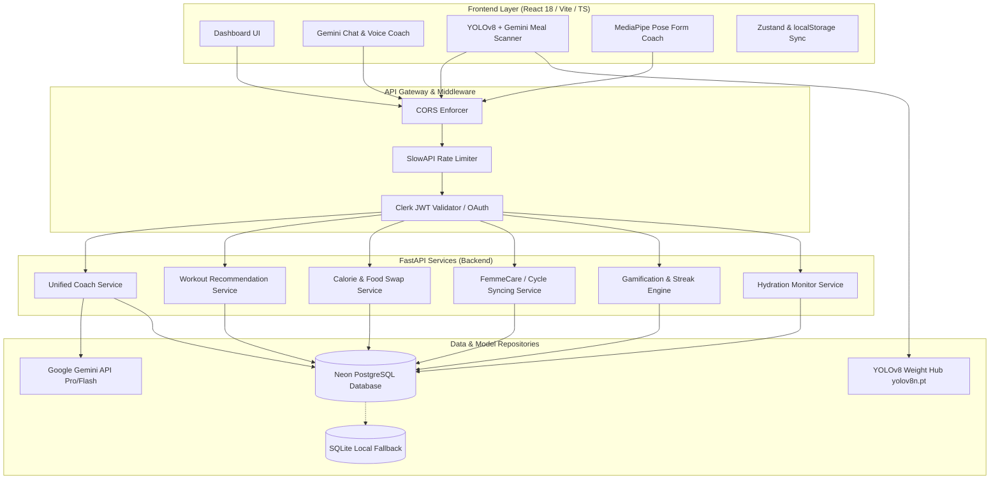

# 🏋️ SMARTY AI – Platform Reference & Architecture Guide

Welcome to the comprehensive technical documentation for the **SMARTY AI Neural Fitness Intelligence Platform**. This document details the system design, database schemas, backend services, frontend page flows, API communications, and integrated Machine Learning (ML) pipelines.

---

## 📌 Table of Contents
1. [Platform Overview & Design Philosophy](#1-platform-overview--design-philosophy)
2. [System Architecture](#2-system-architecture)
3. [Database & Data Persistence Schema](#3-database--data-persistence-schema)
4. [Backend Service Layer & Logic Engines](#4-backend-service-layer--logic-engines)
5. [API Endpoint Directory](#5-api-endpoint-directory)
6. [Frontend Client Architecture](#6-frontend-client-architecture)
7. [AI, Vision, & Pose Estimation Pipelines](#7-ai-vision--pose-estimation-pipelines)
8. [Setup & Running Locally](#8-setup--running-locally)

---

## 1. Platform Overview & Design Philosophy

SMARTY AI is a production-grade, service-oriented fitness and nutrition platform. It unifies user biometrics, meals, hydration, workouts, and sleep to generate a personalized health regimen. 

### Key Characteristics:
* **Service-Oriented Architecture (SOA)**: Highly modular services coordinate logic asynchronously.
* **Hybrid Intelligence**: Combines local expert systems (e.g., Mifflin-St Jeor formula, progressive overload scales) with Large Language Models (LLM) orchestration (Google Gemini) and computer vision models (YOLOv8).
* **Dual Database Adaptability**: Features self-healing fallback mechanisms that support local development (SQLite) and high-performance serverless deployments (Neon PostgreSQL).
* **High-Fidelity Aesthetics**: A responsive frontend design featuring dynamic charts, animated progress metrics, and rich transitions.

---

## 2. System Architecture

The following diagram illustrates the workflow from client requests down to the persistence and AI layers:



---

## 3. Database & Data Persistence Schema

The application uses SQLAlchemy to model the relational database schema. Tables automatically adapt to PostgreSQL dialects or local SQLite instances.

### Core Tables

#### 1. `users` (`EnhancedUser`)
Stores user authentication details and core physical configurations.
* **`id`** (Integer, Primary Key)
* **`clerk_user_id`** (String, Unique, Indexed)
* **`username` / `email`** (String, Unique, Indexed)
* **`hashed_password`** (String, Nullable)
* **`age` / `weight_kg` / `height_cm` / `gender`** (Metrics, Nullable)
* **`activity_level`** (String: `sedentary`, `moderate`, `active`)
* **`primary_goal`** (String: `weight_loss`, `muscle_gain`, `maintenance`)
* **`femmecare_enabled` / `menopause_mode` / `pregnancy_mode`** (Boolean flags)
* **`version`** (Integer, Optimistic Locking Version)
* **`created_at` / `updated_at`** (DateTime timestamps)

#### 2. `food_items` & `food_categories`
References nutrition databases for calorie tracking.
* **`id`** (Integer, Primary Key)
* **`category_id`** (Integer, ForeignKey to `food_categories.id`)
* **`name`** (String, Indexed)
* **`calories` / `protein` / `carbs` / `fats`** (Floats per 100g)
* **`recommended_for_goal`** (String matching user fitness goals)
* **`target_muscle_group`** (String for targeted meal recommendations)

#### 3. `meal_logs`
Logs nutrition consumption and includes AI vision metadata.
* **`id`** (Integer, Primary Key)
* **`user_id`** (Integer, ForeignKey to `users.id`)
* **`meal_name`** (String: `Breakfast`, `Lunch`, etc.)
* **`total_calories` / `total_protein` / `total_carbs` / `total_fats`** (Floats)
* **`image_path`** (String path to stored food pictures)
* **`detected_foods`** (JSON listing predicted ingredients and estimated weights)
* **`confidence`** (Float, model confidence rating)

#### 4. `workout_logs`
Tracks completed exercise routines and calculated metabolic burns.
* **`id`** (Integer, Primary Key)
* **`user_id`** (Integer, ForeignKey to `users.id`)
* **`workout_name`** (String)
* **`duration_minutes`** (Integer)
* **`calories_burned`** (Float)
* **`exercises_data`** (JSON detailing sets, reps, weights, and categories)
* **`created_at`** (DateTime)

#### 5. `user_streaks`
Maintains consecutive compliance streaks.
* **`id`** (Integer, Primary Key)
* **`user_id`** (Integer, ForeignKey to `users.id`)
* **`streak_type`** (String: `workout`, `nutrition`, `hydration`, `login`)
* **`current_streak` / `longest_streak`** (Integers)
* **`last_activity_date`** (DateTime)

#### 6. `user_points`
Calculates leaderboard XP and level levels.
* **`user_id`** (Integer, ForeignKey to `users.id`, Unique)
* **`total_points`** (Integer)
* **`level`** (Integer)
* **`experience_points`** (Integer)
* **`workout_points` / `nutrition_points` / `streak_points`** (XP subcategories)

---

## 4. Backend Service Layer & Logic Engines

Dedicated services implement fitness, metabolic, and game rules under `backend/app/`:

### 🧠 Unified Coach Orchestrator (`unified_coach_service.py`)
Acts as the central router of the application. When a user requests a daily briefing:
1. Gathers database history (completed workouts, macros, hydration level, menstrual phase).
2. Performs safety checks (e.g., checks joint status, pregnancy warnings, or cardiac fatigue).
3. Packages the variables into an LLM system prompt.
4. Requests Google Gemini to generate a cohesive "Daily Briefing" that reads like a human coach.

### 🏋️ Workout Recommendation Engine (`workout_recommendation_service.py` & `workout_recommendations.py`)
Uses fitness profile rules to plan customized training schedules:
* **Fat Loss**: Prioritizes circuit routines and high metabolic cardio.
* **Muscle Gain**: Implements a progressive overload tracker, specifying target weights, set counts, and recovery rest timers.
* **Deload Gating**: Deloads or schedules rest if sleep metrics indicate a recovery deficit.

### 🍽️ Nutrition & Portion Optimizer (`food_swap_service.py` & `calorie_tracker_service.py`)
* **Food Swap Engine**: Calculates cosine similarities across food macronutrient vectors to identify healthy, target-appropriate swaps (e.g., suggesting Greek Yogurt over Sour Cream).
* **Portion Optimizer**: Automatically adjusts food item grams in meal plans to match daily calorie limits.

### 🩺 Female Cycle Syncer (`gender_specific_service.py` & `female.py`)
Tailors health suggestions to biological changes:
* **Follicular/Ovulatory Phase**: Recommends strength splits and progressive overload targets.
* **Luteal/Menstrual Phase**: Restricts heavy training, recommending yoga, stretching, and iron-dense food recommendations.
* **Pregnancy Mode**: Restricts movements to safe angles, enforcing strict health guidelines.

### 🎮 Gamification Engine (`gamification_service.py`)
Runs checks on database commit events:
* Award points (e.g., +50 XP for a workout, +10 XP for hydration).
* Increments levels at `XP = level * 1000`.
* Checks conditional criteria to unlock one of the 14 badges (e.g., unlocking "Consistency King" on a 7-day streak).

---

## 5. API Endpoint Directory

Below are key API endpoints exposed by the FastAPI backend:

### Authentication & Profiles
* `POST /api/auth/register` - Creates standard user account credentials.
* `POST /api/auth/login` - Validates credentials and returns JWT tokens.
* `GET /api/users/{user_id}/profile` - Retrieves user physical goals, constraints, and preferences.
* `PUT /api/users/{user_id}/profile` - Updates body statistics (weight, height, age).

### Nutrition & Scanner
* `POST /api/nutrition/cam-detect-log` - Stores a photo detection log with macro totals.
* `POST /api/nutrition/calculate-portion` - Calculates macro splits for custom weight measurements.
* `GET /api/food/goal/{goal}` - Returns database foods tagged for specific fitness goals.
* `POST /api/meal-planning/generate` - Constructs weekly meal recipes and optimized shopping lists.

### Workouts & Biomechanics
* `POST /api/workouts/log` - Logs exercise performance metrics and triggers XP rewards.
* `GET /api/exercises/for-goal/{goal}` - Fetches fitness goal-aligned movement patterns.
* `POST /api/feedback/` - Saves Pose Estimation errors (e.g., knee cave warnings during squats) to train local predictive models.

### Intelligence & Diagnostics
* `GET /api/coach/daily` - Aggregates stats to generate the Gemini Daily Coach report.
* `GET /api/neural/recovery` - Calculates the Mission Readiness Score (MRS).
* `GET /api/female/cycle-phase/{user_id}` - Provides phase-specific hormonal insights.

---

## 6. Frontend Client Architecture

The frontend is built on **React 18** with **Vite** and **TypeScript**, styled using a premium Glassmorphism design system.

### Key Directory Layout
* **`/src/pages/`**: Includes view containers like `Dashboard.tsx`, `MealScanner.tsx`, `FemmeCare.tsx`, `FormCorrector.tsx`, and `WorkoutAssistant.tsx`.
* **`/src/components/`**: Reusable components, including `RestTimer.tsx`, `HydrationHub.tsx`, `AnimatedNumber.tsx`, and `SmartyChat.tsx`.
* **`/src/services/`**: Communication layers:
  * `apiService.ts`: Core Axios/Fetch wrapper managing bearer authentication, token refresh flows, and HTTP errors.
  * `geminiService.ts`: Integrates local chat interactions with LLM models.
  * `syncQueue.ts`: Manages offline log queues to synchronize when internet connection is restored.
* **`/src/contexts/`**: Holds user state, authentication tokens, global error handlers, and themes.

### Client-Side State & Storage
Local configuration and authentication tokens are cached securely in the browser's `localStorage` and managed across component states.

---

## 7. AI, Vision, & Pose Estimation Pipelines

SMARTY AI implements specialized computer vision and pose tracking workflows:

### A. YOLOv8 & Gemini Vision Meal Scanning Pipeline
```
                    ┌─────────────────────────┐
                    │  User Uploads Food Pic  │
                    └────────────┬────────────┘
                                 │
                                 ▼
                     [Image Preprocessor API]
                                 │
                  ┌──────────────┴──────────────┐
                  ▼                             ▼
        [YOLOv8 Local Model]           [Gemini Vision API]
        • Fast bounding box            • Textual ingredient identification
        • Cultural recipe parsing      • Estimated serving sizes
                  │                             │
                  └──────────────┬──────────────┘
                                 ▼
                    [Hybrid Fusion Processor]
                    • Reconciles boundaries with categories
                    • Queries DB food calories per 100g
                    • Calculates macro profile for portions
```

### B. MediaPipe Pose Estimation
Used in `FormCorrector.tsx` and `LiveCoach.tsx`:
1. Reads the user's camera feed using webcams.
2. Calculates coordinate arrays for key joints (Shoulders, Hips, Knees, Ankles) in real time.
3. Computes relative angles (e.g., knee flexion angle during squats).
4. Highlights posture errors (e.g., knee cave, lower back rounding) using audio cues and screen alerts, then logs these metrics to the backend.

---

## 8. Setup & Running Locally

To get the entire platform up and running in a local environment:

### Prerequisites:
* Python 3.10+
* Node.js 18+

### Setup Commands

#### 1. Start the Backend
```bash
cd backend
python -m venv venv
source venv/bin/activate  # Windows: venv\Scripts\activate

# Install requirements
pip install -r requirements-base.txt
# (Optional) Install ML-specific libraries: pip install -r requirements-ml.txt

# Set environment keys
copy .env.example .env

# Initialize and seed database
python init_database.py
python init_gamification.py

# Run server
uvicorn main:app --reload --port 8000
```

#### 2. Start the Frontend
```bash
cd frontend
npm install
npm run dev
```
Open `http://localhost:5173` to interact with the dashboard.

---
*Document maintained by the Smarty AI Engineering Team.*
