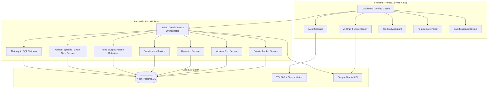

# 🏋️ SMARTY AI – Neural Fitness Intelligence Platform

> **A production-ready, full-stack AI-powered fitness and nutrition platform** that combines local machine learning models, rule-based expert engines, and LLM orchestration (Google Gemini) to deliver hyper-personalized health, nutrition, and exercise guidance.

[](https://github.com/AadityaUniyal/Fitness_Smarty/actions/workflows/ci.yml)


---

## 📖 Table of Contents

- [Overview](#-overview)
- [Key Features](#-key-features)
- [System Architecture](#-system-architecture)
- [Technology Stack](#-technology-stack)
- [Core Service Modules](#-core-service-modules)
- [API Reference](#-api-reference)
- [Quick Start](#-quick-start)
- [Environment Configuration](#-environment-configuration)
- [Deployment](#-deployment)
- [Testing](#-testing)
- [License](#-license)

---

## 🌟 Overview

**SMARTY AI** is a next-generation personal fitness ecosystem that organizes a user's entire day—workouts, meals, hydration, recovery, and habits—into a cohesive daily directive.

At its core, the platform operates on a **Service-Oriented Architecture (SOA)**:
- **Rule & ML Engines**: Dedicated backend services perform localized algorithmic profiling (e.g., Mifflin-St Jeor formulas, progressive overload calculations, symptom-aware cycle syncing, and sleep-based recovery gating).
- **LLM Orchestration**: Google Gemini Pro processes these structured data inputs and generates natural, encouraging, and context-aware narration for the user's dashboard briefing.
- **Computer Vision**: Food detection utilizes YOLOv8 combined with Gemini Vision API to instantly log and estimate portion sizes from uploaded photos.
- **Gamification**: Real-time monitoring of database commits unlocks badges, increments levels, and tracks daily streaks.

---

## ✨ Key Features

### 🍽️ Intelligent Nutrition & Hydration
- **AI Meal Scanner**: YOLOv8 + Gemini Vision API pipeline to detect food items, estimate weights, and log exact macro breakdowns.
- **Food Swap Engine**: Suggests healthier food alternatives matching the user's taste profile, calorie limits, and cultural context.
- **Portion Optimizer**: Automatically adjusts food serving weights to hit precise daily caloric and protein targets.
- **Hydration Tracker**: Computes dynamic daily water targets based on climate, body weight, and exercise expenditure, with automated progress logs.
- **Enhanced Meal Planner**: Automatically constructs weekly meal plans, structures shopping lists, and optimizes circadian meal timing around workouts.

### 💪 Workout & Biomechanical Intelligence
- **6-Day Adaptive Workout Planner**: Algorithmic routine generator that dynamically sets muscle focus, exercises, sets, and reps based on target fitness goals.
- **Progressive Overload Tracker**: Monitors strength volume history to automatically scale weights and reps for continuous hypertrophic progression.
- **Muscle Recovery Gating**: Computes a dynamic **Mission Readiness Score (MRS)** utilizing sleep metrics and muscle-group fatigue graphs, scaling workout intensity to "deload" or "rest" when recovery is low.
- **Form Correction AI**: Integrates MediaPipe and TensorFlow pose estimation to track joint angles and log posture faults in real time.

### 🩺 Cycle-Synced Female Health (FemmeCare)
- **Hormonal Synchronization**: Dynamically tracks menstrual cycle phases (Menstrual, Follicular, Ovulatory, Luteal) to customize exercise recommendations.
- **Symptom-Aware Adaptation**: Automatically suggests lower training intensities and specific restorative stretches when severe symptoms (cramping, fatigue) are logged.
- **Menopause Support Mode**: Specialized strength recommendations focused on bone-density preservation and joint health.
- **Pregnancy Safe Mode**: Excludes flat-lying or high-impact movements, strictly aligning recommendations with ACOG safety guidelines.

### 🎮 Immersive Gamification
- **Point & Level System**: Earn experience points (XP) for logging meals, completing workouts, and meeting hydration goals.
- **Real-Time Badge Unlocks**: 14 tiered badges (Bronze to Diamond) across workout, nutrition, streak, and social milestones.
- **Streak Engine**: Tracks consecutive active days across workout logging, hydration compliance, and meal logging.
- **Social Leaderboards**: Real-time community rankings displaying user level, XP, and weekly points.

---

## 🏗️ System Architecture



---

## 🛠️ Technology Stack

- **Frontend**: React 18, TypeScript, Vite, Tailwind CSS, Framer Motion, Axios, React Query, Zustand.
- **Backend**: FastAPI, SQLAlchemy, Pydantic, Alembic, Uvicorn, SlowAPI (Rate Limiting), PyTest.
- **AI/ML**: PyTorch (LSTM weight predictor), YOLOv8 (Food detection), Google Gemini Pro & Flash (NLG & Vision), MediaPipe (Pose estimation).
- **Database & Hosting**: Neon PostgreSQL (Serverless Cloud DB), SQLite (In-Memory Testing), Docker & Docker Compose, Vercel Serverless.

---

## 📁 Core Service Modules

All business logic is isolated within dedicated service classes inside `backend/app/`:

- **[unified_coach_service.py](file:///c:/Users/HP/OneDrive/Desktop/Smarty-reco/backend/app/unified_coach_service.py)**: The central orchestrator. Aggregates data from all other services, runs safety checks, and formats the contextual prompt for Google Gemini to output the daily dashboard briefing.
- **[calorie_tracker_service.py](file:///c:/Users/HP/OneDrive/Desktop/Smarty-reco/backend/app/calorie_tracker_service.py)**: Automatically calculates calories consumed vs. burned and aggregates net daily calorie deficits.
- **[workout_recommendation_service.py](file:///c:/Users/HP/OneDrive/Desktop/Smarty-reco/backend/app/workout_recommendation_service.py)**: Matches user goals and training history to build structured workout splits.
- **[hydration_service.py](file:///c:/Users/HP/OneDrive/Desktop/Smarty-reco/backend/app/hydration_service.py)**: Tracks water logs, compares them against dynamic calculated goals, and rewards milestones.
- **[gamification_service.py](file:///c:/Users/HP/OneDrive/Desktop/Smarty-reco/backend/app/gamification_service.py)**: Tracks XP progression, levels, badges, and streaks. Evaluates thresholds on every log database commit.
- **[food_swap_service.py](file:///c:/Users/HP/OneDrive/Desktop/Smarty-reco/backend/app/food_swap_service.py)**: Evaluates foods on macronutrient similarity distance vectors to provide health swaps.
- **[gender_specific_service.py](file:///c:/Users/HP/OneDrive/Desktop/Smarty-reco/backend/app/gender_specific_service.py)**: Adjusts calorie targets and metabolic formulas for pregnancy, menopause, or cycle syncing.

---

## 🚀 Quick Start

### 1. Backend Setup
```bash
cd backend
python -m venv venv
# Windows:
venv\Scripts\activate
# Linux/Mac:
source venv/bin/activate

pip install -r requirements-base.txt
copy .env.example .env

# Initialize database schema and seed tables
python migrate_gamification.py

# Start developer server
uvicorn main:app --reload --port 8000
```
API docs will be live at: `http://localhost:8000/docs`

### 2. Frontend Setup
```bash
cd frontend
npm install
copy .env.local.example .env.local
npm run dev
```
Client will be live at: `http://localhost:5173`

---

## 🧪 Testing

The platform utilizes `pytest` to execute unit, API, and service-layer validation. In environments where heavy machine learning dependencies (e.g., PyTorch) are omitted, tests automatically scale down and skip safely.

```bash
cd backend
pytest -v
```

---

<p align="center">
  <strong>SMARTY AI</strong> — Train Beyond Limits. Intelligently.<br>
  Built with ❤️ by the Smarty AI Team
</p>
