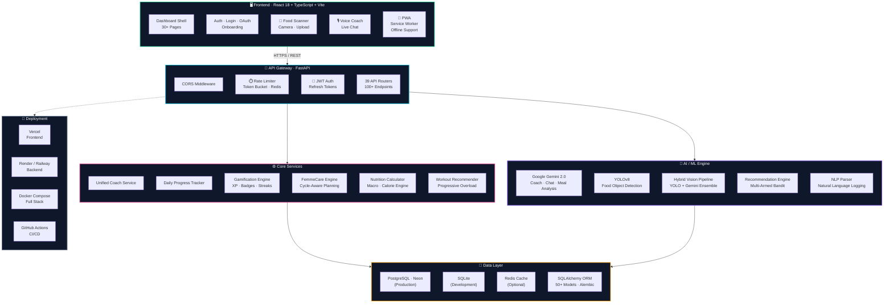
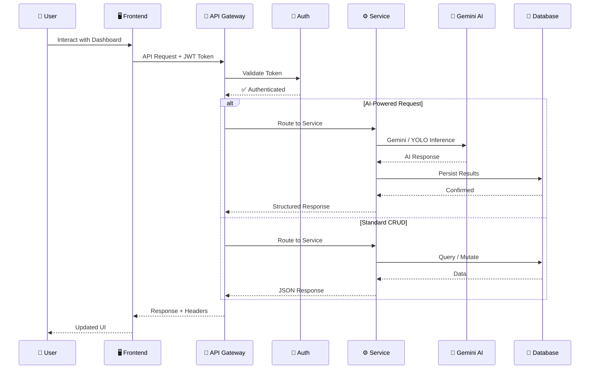
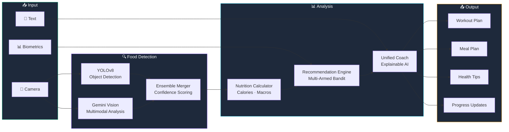
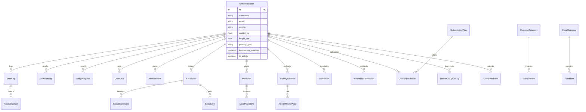

<p align="center">
  
  
  
  
  
  
  
</p>

# ⚡ SMARTY AI — Neural Fitness Platform

> **AI-powered full-stack fitness, nutrition & wellness platform** with real-time coaching, computer vision food scanning, FemmeCare-aware support, gamification, and 30+ dashboard screens.

---

## 🏗️ System Architecture



---

## 🔄 Request Lifecycle



---

## 📁 Project Structure

```
Smarty-reco/
├── 📂 backend/                    # FastAPI Python Backend
│   ├── main.py                    # App entry, router registration, lifespan
│   ├── app/
│   │   ├── __init__.py            # Model exports
│   │   ├── models.py              # 50+ SQLAlchemy ORM models
│   │   ├── database.py            # DB engine, sessions, seed functions
│   │   ├── schemas.py             # Pydantic request/response schemas
│   │   ├── config.py              # Pydantic Settings with production guards
│   │   ├── auth.py                # JWT auth, password hashing, token refresh
│   │   ├── limiter.py             # Token-bucket rate limiter (Redis + local)
│   │   ├── api/                   # 39 API router modules
│   │   │   ├── auth.py            #   /api/auth — register, login, refresh
│   │   │   ├── oauth.py           #   /api/auth/oauth — Google OAuth 2.0
│   │   │   ├── users.py           #   /api/users — profiles, goals, settings
│   │   │   ├── admin.py           #   /api/admin — admin dashboard
│   │   │   ├── meals.py           #   /api/meals — meal logging & analysis
│   │   │   ├── exercises.py       #   /api/exercises — exercise library CRUD
│   │   │   ├── ai_coach.py        #   /api/ai — Gemini chat, workout, meal AI
│   │   │   ├── coach.py           #   /api/coach — unified daily coach
│   │   │   ├── daily_progress.py  #   /api/daily-progress — live progress
│   │   │   ├── calorie_tracking.py#   /api/calorie-tracking — macro tracking
│   │   │   ├── hydration.py       #   /api/hydration — water intake
│   │   │   ├── gamification.py    #   /api/gamification — XP, badges, streaks
│   │   │   ├── female.py          #   /api/female — FemmeCare endpoints
│   │   │   ├── gender_health.py   #   /api/gender-health — cycle-aware health
│   │   │   ├── vision_ws.py       #   /api/vision — YOLOv8 food detection
│   │   │   ├── meal_planner.py    #   /api/meal-plans — weekly meal plans
│   │   │   ├── enhanced_meal_planning.py
│   │   │   ├── smart_meals.py     #   /api/smart-meals — AI meal recommendations
│   │   │   ├── food.py            #   /api/food — food database search
│   │   │   ├── food_swaps.py      #   /api/food-swaps — healthier alternatives
│   │   │   ├── recommendations.py #   /api/recommendations — smart recs
│   │   │   ├── workout_recommendations.py
│   │   │   ├── progress_tracking.py
│   │   │   ├── goal_validation.py #   /api/goals — goal management
│   │   │   ├── activities.py      #   /api/activities — activity tracking
│   │   │   ├── social.py          #   /api/social — social feed
│   │   │   ├── form_coach.py      #   /api/form-coach — exercise form analysis
│   │   │   ├── wearables.py       #   /api/wearables — device integrations
│   │   │   ├── reminders.py       #   /api/reminders — notifications
│   │   │   ├── smart_notifications.py
│   │   │   ├── billing.py         #   /api/billing — Stripe subscriptions
│   │   │   ├── feedback.py        #   /api/feedback — user feedback
│   │   │   ├── tasks.py           #   /api/tasks — daily checklist
│   │   │   ├── nextmove.py        #   /api/nextmove — smart next actions
│   │   │   ├── analytics.py       #   /api/analytics — user analytics
│   │   │   ├── advanced_analytics.py
│   │   │   ├── extensions.py      #   /api/extensions — backend extensions
│   │   │   └── neural.py          #   /api/neural — neural infrastructure
│   │   ├── unified_coach_service.py    # Core coaching logic
│   │   ├── recommendation_engine.py    # ML recommendation engine
│   │   ├── food_detection_model.py     # YOLOv8 food detection
│   │   ├── gemini_meal_scanner.py      # Gemini vision integration
│   │   ├── meal_analysis_service.py    # Meal nutrition analysis
│   │   ├── gamification_service.py     # XP, achievements, badges, streaks
│   │   ├── gender_specific_service.py  # FemmeCare cycle-aware logic
│   │   ├── hydration_service.py        # Hydration monitoring
│   │   ├── calorie_tracker_service.py  # Calorie & macro calculations
│   │   ├── workout_recommendation_service.py
│   │   ├── nutrition_calculator.py     # TDEE, BMR, macro splits
│   │   ├── progressive_overload.py     # Training progression logic
│   │   ├── image_processor.py          # Image processing pipeline
│   │   ├── email_service.py            # SMTP email notifications
│   │   ├── neon_config.py              # Neon PostgreSQL configuration
│   │   ├── error_handler.py            # Centralized error handling
│   │   ├── logging_config.py           # Structured JSON logging
│   │   └── ...                         # 87 modules total
│   ├── tests/                     # 41 pytest test files
│   ├── migrations/                # Alembic database migrations
│   ├── requirements-base.txt      # Core Python dependencies
│   ├── requirements-ml.txt        # ML/DL dependencies (PyTorch, YOLO, etc.)
│   └── Dockerfile
│
├── 📂 frontend/                   # React 18 + TypeScript + Vite
│   ├── index.html                 # Entry HTML with TensorFlow.js, fonts, PWA
│   ├── index.css                  # Global styles (Tailwind CSS v4)
│   ├── src/
│   │   ├── main.tsx               # Vite entry point
│   │   ├── index.tsx              # React root with PWA service worker
│   │   ├── App.tsx                # Router, auth guards, dashboard shell
│   │   ├── i18n.ts                # Internationalization (English + Hindi)
│   │   ├── pages/                 # 30+ page components
│   │   │   ├── LoginPage.tsx      #   Auth with Google OAuth + guest mode
│   │   │   ├── OnboardingPage.tsx #   User profile setup wizard
│   │   │   ├── Dashboard.tsx      #   Main dashboard with live progress
│   │   │   ├── MealScanner.tsx    #   Camera food scanning + AI analysis
│   │   │   ├── WorkoutAssistant.tsx#  AI workout builder + timer
│   │   │   ├── NutritionHub.tsx   #   Nutrition tracking + analytics
│   │   │   ├── MealPlanner.tsx    #   Weekly AI-generated meal plans
│   │   │   ├── LiveCoach.tsx      #   Voice + text AI coaching
│   │   │   ├── FemmeCare.tsx      #   Menstrual cycle wellness
│   │   │   ├── FemaleDashboard.tsx#   Female-specific health dashboard
│   │   │   ├── Achievements.tsx   #   Gamification achievements & badges
│   │   │   ├── ProgressTracking.tsx#  Charts, graphs, trends
│   │   │   ├── BodyMeasurements.tsx#  Body composition tracking
│   │   │   ├── SleepTracker.tsx   #   Sleep quality logging
│   │   │   ├── MoodTracker.tsx    #   Mood & energy tracking
│   │   │   ├── ActivityTracker.tsx#   Steps, distance, calories
│   │   │   ├── HydrationHub.tsx   #   Water intake tracking
│   │   │   ├── SocialFeed.tsx     #   Community social features
│   │   │   ├── FormCorrector.tsx  #   AI form analysis (TF.js pose)
│   │   │   ├── WearableIntegrations.tsx
│   │   │   ├── AdminWorkspace.tsx #   Admin panel
│   │   │   ├── AiInterpreter.tsx  #   AI text interpreter
│   │   │   └── ...
│   │   ├── components/            # 23 reusable components
│   │   ├── services/              # API + AI service layers
│   │   │   ├── apiService.ts      #   REST client + JWT auto-refresh
│   │   │   ├── geminiService.ts   #   Gemini AI integration
│   │   │   ├── visionService.ts   #   YOLOv8 + hybrid detection
│   │   │   ├── exportService.ts   #   Data export (PDF, CSV, JSON)
│   │   │   ├── storageService.ts  #   Local storage management
│   │   │   ├── syncQueue.ts       #   Offline sync queue
│   │   │   └── notificationService.ts
│   │   ├── contexts/              # React context providers
│   │   ├── hooks/                 # Custom React hooks
│   │   ├── types/                 # TypeScript type definitions
│   │   └── styles/                # CSS animations & utilities
│   ├── public/
│   │   ├── manifest.json          # PWA manifest
│   │   ├── sw.js                  # Service worker
│   │   ├── privacy-policy.html
│   │   └── terms-of-service.html
│   ├── package.json
│   ├── vite.config.ts
│   └── tsconfig.json
│
├── 📂 docker/                     # Docker deployment
│   ├── docker-compose.yml         # Full-stack orchestration
│   ├── Dockerfile.backend
│   ├── Dockerfile.frontend
│   ├── Dockerfile.monolithic
│   └── nginx.conf                 # Reverse proxy config
│
├── 📂 .github/workflows/         # CI/CD
│   ├── ci.yml                     # Full CI: lint, test, build, Docker
│   ├── pytest.yml                 # Backend test runner
│   └── python-tests.yml           # Python test matrix
│
├── .gitignore
├── .env.example                   # Environment variable template
├── vercel.json                    # Vercel deployment config
├── setup.bat / setup.sh           # One-click setup scripts
├── LICENSE                        # MIT License
└── README.md                      # This file
```

---

## 🧠 AI / ML Pipeline



### Models & Integrations

| Component | Technology | Purpose |
|-----------|-----------|---------|
| **Food Detection** | YOLOv8 (Ultralytics) | Real-time food object detection from camera |
| **Vision Analysis** | Google Gemini 2.0 Flash | Multimodal meal image understanding |
| **Hybrid Pipeline** | YOLO + Gemini Ensemble | High-accuracy food identification |
| **NLP Parser** | Custom + Gemini | Natural language meal & workout logging |
| **Recommendations** | Multi-Armed Bandit (scikit-learn) | Personalized workout & food recommendations |
| **Form Analysis** | TensorFlow.js PoseNet | Real-time exercise form correction |
| **Forecasting** | LSTM + Prophet | Progress trend prediction |
| **Explainability** | SHAP | Model decision transparency |

---

## 🗄️ Database Schema



> **50+ database tables** including users, meals, workouts, social, billing, gamification, FemmeCare, wearables, notifications, and more.

---

## ✨ Feature Overview

### 🏋️ Fitness & Training
- **AI Workout Builder** — Gemini-powered workout plans based on goals, equipment, and recovery
- **Exercise Library** — 800+ exercises with muscle groups, difficulty, and video links
- **Progressive Overload** — Automatic training progression tracking
- **Form Coach** — Real-time pose estimation for exercise form correction (TensorFlow.js)
- **Workout History** — Complete training log with performance analytics
- **Quick Workouts** — Pre-built express routines

### 🍽️ Nutrition & Food
- **AI Food Scanner** — Camera-based meal scanning with YOLOv8 + Gemini hybrid detection
- **Calorie & Macro Tracking** — Automatic TDEE/BMR calculations
- **Weekly Meal Planner** — AI-generated 7-day meal plans
- **Smart Food Swaps** — Healthier alternative suggestions
- **Nutrition Hub** — Comprehensive food database with search
- **Indian Food Database** — Localized nutrition data

### 🧠 AI & Coaching
- **Unified Daily Coach** — Explainable AI coaching with reasoning transparency
- **Voice Coach** — Live voice-enabled AI coaching
- **AI Chat** — Natural language fitness Q&A powered by Gemini
- **Smart Next Move** — Context-aware action suggestions
- **NLP Food Logger** — Log meals with natural language

### 💗 FemmeCare
- **Menstrual Cycle Tracking** — Period, flow, symptom logging
- **Cycle-Aware Workouts** — Exercise recommendations adapted to cycle phase
- **Cycle-Aware Nutrition** — Macro adjustments for hormonal phases
- **Female-Specific Dashboard** — Dedicated wellness hub
- **Encrypted Health Data** — FemmeCare data encrypted at rest

### 📊 Analytics & Progress
- **Live Daily Progress** — Real-time calorie, workout, hydration tracking
- **Progress Photos** — Visual body transformation timeline
- **Body Measurements** — Weight, body fat, measurements tracking
- **Weekly Reviews** — Automated weekly progress summaries
- **Advanced Analytics** — Trends, predictions, and insights

### 🎮 Gamification
- **XP System** — Earn experience points for activities
- **Achievements & Badges** — Unlock milestones
- **Streak Tracking** — Daily consistency streaks
- **Leaderboard-ready** — Social competition framework

### 🌐 Social & Community
- **Social Feed** — Post workouts, meals, and achievements
- **Likes & Comments** — Community engagement
- **Follow System** — Follow other users
- **Activity Sharing** — Share progress with friends

### ⌚ Integrations
- **Wearable Devices** — Connect fitness trackers
- **Google OAuth** — One-click authentication
- **Stripe Billing** — Subscription management
- **Email Notifications** — SMTP-based alerts
- **Data Export** — Export data as PDF, CSV, or JSON

### 🌍 Accessibility & UX
- **PWA Support** — Install as mobile app, offline-capable
- **Dark/Light Theme** — Toggle between themes
- **i18n** — English + Hindi language support
- **Responsive Design** — Mobile-first, works on all devices
- **Smooth Animations** — Micro-interactions and transitions

---

## 🚀 Getting Started

### Prerequisites

| Tool | Version |
|------|---------|
| **Python** | 3.10+ |
| **Node.js** | 20+ |
| **npm** | 9+ |
| **Git** | Latest |

### Quick Setup

#### 1. Clone the Repository

```bash
git clone https://github.com/AadityaUniyal/Fitness_Smarty.git
cd Fitness_Smarty
```

#### 2. Backend Setup

```bash
cd backend
python -m venv venv

# Windows
venv\Scripts\activate
# macOS / Linux
source venv/bin/activate

pip install -r requirements-base.txt
cp .env.example .env        # Edit .env with your API keys
python init_database.py      # Initialize database schema
uvicorn main:app --reload --port 8000
```

#### 3. Frontend Setup

```bash
cd frontend
npm install
npm run dev                  # Starts at http://localhost:5173
```

#### 4. Docker (Full Stack)

```bash
cd docker
cp ../backend/.env.example ../backend/.env  # Fill in real values
docker compose up --build -d
```

---

## 🔑 Environment Variables

Create a `.env` file in `backend/` from the provided `.env.example`:

| Variable | Required | Description |
|----------|----------|-------------|
| `ENVIRONMENT` | ✅ | `development` / `test` / `production` |
| `DATABASE_URL` | ✅ | PostgreSQL (prod) or SQLite (dev) |
| `JWT_SECRET_KEY` | 🔒 Prod | Secret for JWT token signing |
| `SECRET_KEY` | 🔒 Prod | App secret key |
| `GEMINI_API_KEY` | 🧠 AI | Google Gemini API key |
| `GOOGLE_CLIENT_ID` | 🔐 OAuth | Google OAuth client ID |
| `GOOGLE_CLIENT_SECRET` | 🔐 OAuth | Google OAuth client secret |
| `CORS_ORIGINS` | ✅ | Comma-separated allowed origins |
| `SMTP_HOST` | 📧 Email | SMTP server for notifications |
| `REDIS_URL` | ⚡ Cache | Redis URL for rate limiting |
| `FEMME_SECRET_KEY` | 🔒 Prod | Encryption key for FemmeCare data |
| `ADMIN_PASSWORD` | 🔐 Admin | Admin panel password |

---

## 🧪 Testing

### Backend (pytest)

```bash
cd backend
python -m pytest -q                           # Quick run
python -m pytest --cov=app --cov-report=html   # With coverage
python -m pytest tests/test_auth_flow.py -v   # Specific test
```

**41 test files** covering auth, API endpoints, ML models, security, gamification, and more.

### Frontend (Vitest)

```bash
cd frontend
npm test                    # Run all tests
npm run test:watch          # Watch mode
npm run test:coverage       # With coverage report
```

### CI/CD

GitHub Actions runs on every push/PR to `main`:
- ✅ Python 3.10 + 3.11 backend tests with coverage
- ✅ Frontend TypeScript check + build verification
- ✅ Docker image build test
- ✅ Ruff linting

---

## 🌐 API Reference

The backend exposes **100+ REST endpoints** across **39 routers**:

<details>
<summary><b>📋 Click to expand full API route table</b></summary>

| Prefix | Tag | Key Endpoints |
|--------|-----|---------------|
| `/api/auth` | Authentication | Register, Login, Token Refresh, Password Reset |
| `/api/auth/oauth` | OAuth | Google OAuth login/callback |
| `/api/users` | User Profile | Get/Update profile, goals, settings |
| `/api/admin` | Admin | User management, system stats |
| `/api/ai` | AI Coach | Chat, workout plans, meal analysis, daily tasks |
| `/api/coach` | Unified Coach | Daily coach, explainable coach, history |
| `/api/meals` | Meal Analysis | Log meals, scan results, history |
| `/api/exercises` | Exercises | Browse, search, CRUD exercise library |
| `/api/calorie-tracking` | Calories | Log calories, macro breakdown, daily totals |
| `/api/daily-progress` | Daily Progress | Live progress, reset, summary |
| `/api/hydration` | Hydration | Log water intake, daily goals |
| `/api/meal-plans` | Meal Planner | Generate/save weekly plans |
| `/api/meal-planning` | Enhanced Plans | AI-powered meal plan generation |
| `/api/smart-meals` | Smart Meals | AI meal recommendations |
| `/api/food` | Food Database | Search foods, nutrition lookup |
| `/api/food-swaps` | Food Swaps | Healthier alternatives |
| `/api/recommendations` | Recommendations | Smart workout & food recs |
| `/api/workout-recommendations` | Workouts | Personalized workout suggestions |
| `/api/progress` | Progress | Tracking, trends, snapshots |
| `/api/goals` | Goals | Goal CRUD, validation, milestones |
| `/api/gamification` | Gamification | XP, badges, achievements, streaks |
| `/api/activities` | Activities | Session tracking, routes, metrics |
| `/api/social` | Social Feed | Posts, comments, likes, follows |
| `/api/form-coach` | Form Coach | Exercise form analysis sessions |
| `/api/wearables` | Wearables | Device connections, sync metrics |
| `/api/reminders` | Reminders | Notification scheduling |
| `/api/notifications` | Smart Notifications | Push notification management |
| `/api/billing` | Billing | Stripe subscriptions, invoices |
| `/api/feedback` | Feedback | User feedback submission |
| `/api/tasks` | Daily Checklist | Daily task management |
| `/api/nextmove` | Smart Next Move | Context-aware suggestions |
| `/api/analytics` | Analytics | User activity analytics |
| `/api/female` | Female Health | FemmeCare-specific endpoints |
| `/api/gender-health` | Gender Health | Cycle-aware health data |
| `/api/extensions` | Extensions | Backend extension system |
| `/api/neural` | Neural | Infrastructure & diagnostics |
| `/api/vision` | Vision | YOLOv8 detection, hybrid pipeline |
| `/health` | Health Check | Service health status |
| `/ready` | Readiness | DB + service readiness probe |

</details>

> 💡 **Interactive API docs** available at `http://localhost:8000/docs` (Swagger UI) and `http://localhost:8000/redoc` (ReDoc) in development mode.

---

## 🐳 Deployment

### Vercel (Frontend)

The repository includes `vercel.json` with:
- SPA rewrites for client-side routing
- Security headers (X-Content-Type-Options, X-Frame-Options, Referrer-Policy)
- Static asset caching (1 year, immutable)

### Docker Compose (Full Stack)

```bash
cd docker
docker compose up --build -d
# Frontend: http://localhost:3000
# Backend:  http://localhost:8000
```

### Production Checklist

- [ ] Set `ENVIRONMENT=production`
- [ ] Configure PostgreSQL `DATABASE_URL` (Neon recommended)
- [ ] Set strong `JWT_SECRET_KEY` and `SECRET_KEY`
- [ ] Set `FEMME_SECRET_KEY` for FemmeCare encryption
- [ ] Configure explicit `CORS_ORIGINS` (no wildcards)
- [ ] Set `GEMINI_API_KEY` for AI features
- [ ] Configure SMTP for email notifications
- [ ] Set up Redis for distributed rate limiting

---

## 🛡️ Security

- **JWT Authentication** with access + refresh token rotation
- **bcrypt** password hashing (cost factor 12)
- **Rate Limiting** — Tiered token-bucket (AI: 10/min, Write: 30/min, Read: 120/min)
- **CORS** — Strict origin enforcement in production
- **Production Guards** — App crashes on missing secrets in production
- **FemmeCare Encryption** — Sensitive health data encrypted at rest
- **Input Validation** — Pydantic schemas on all endpoints
- **SQL Injection Protection** — SQLAlchemy ORM parameterized queries
- **Security Headers** — CSP, X-Frame-Options, Referrer-Policy via Vercel/Nginx

---

## 🛠️ Tech Stack

### Backend
| Technology | Purpose |
|-----------|---------|
| **FastAPI** | Async Python web framework |
| **SQLAlchemy** | ORM with optimistic locking |
| **Alembic** | Database migrations |
| **Pydantic** | Data validation & settings |
| **PostgreSQL / Neon** | Production database |
| **SQLite** | Development database |
| **Redis** | Caching & rate limiting |
| **YOLOv8 (Ultralytics)** | Computer vision food detection |
| **Google Gemini** | Generative AI (chat, vision, planning) |
| **PyTorch** | Deep learning framework |
| **scikit-learn** | ML recommendation engine |
| **SlowAPI** | HTTP rate limiting |
| **python-jose** | JWT token handling |
| **bcrypt** | Password hashing |
| **Stripe** | Payment processing |
| **Gunicorn** | Production WSGI server |

### Frontend
| Technology | Purpose |
|-----------|---------|
| **React 18** | UI framework |
| **TypeScript** | Type-safe development |
| **Vite** | Build tool & dev server |
| **Tailwind CSS v4** | Utility-first styling |
| **React Router v7** | Client-side routing |
| **Recharts** | Data visualization charts |
| **Lucide React** | Icon library |
| **TensorFlow.js** | Client-side pose estimation |
| **Service Worker** | PWA offline support |

### DevOps
| Technology | Purpose |
|-----------|---------|
| **Docker** | Containerization |
| **Docker Compose** | Multi-service orchestration |
| **GitHub Actions** | CI/CD pipeline |
| **Vercel** | Frontend hosting |
| **Nginx** | Reverse proxy |

---

## 📄 License

This project is licensed under the **MIT License** — see the [LICENSE](LICENSE) file for details.

---

<p align="center">
  <b>Built with ⚡ by the Smarty AI Team</b>
  <br/>
  <sub>Neural Fitness v4.0 — Where AI Meets Iron</sub>
</p>
